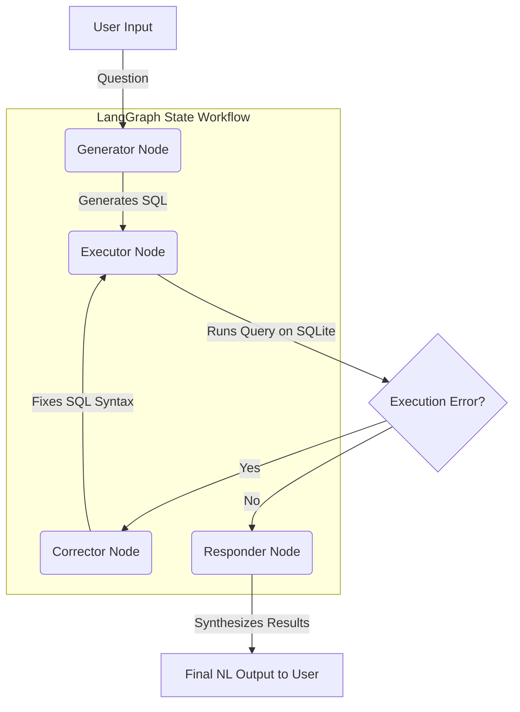
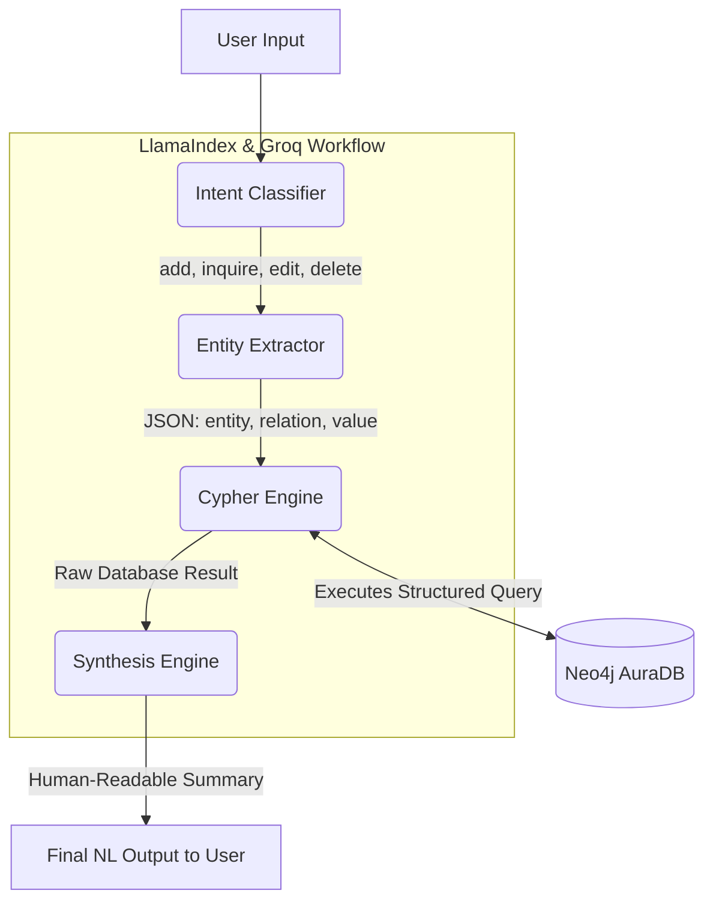

# AI-Powered Inventory & Knowledge Graph Chatbots

This repository contains a dual-agent system designed to interact with enterprise data using natural language. It demonstrates two distinct approaches to AI data retrieval and management: querying a relational SQLite database (Inventory Bot) using LangGraph, and managing a Neo4j graph database (Knowledge Graph Agent) using LlamaIndex.

## 🧠 System Overview

The project is split into two primary terminal-based chatbots, each optimized for a specific type of database architecture. Additionally, an experimental Jupyter Notebook is included for Gemini-powered SQL generation via FastAPI.

---

## 1. Inventory Chatbot (Relational SQL Agent)
An AI agent built with **LangGraph** that translates natural language into SQLite queries. It features a robust self-correction routing loop that automatically catches and fixes syntactically incorrect SQL queries before returning the final answer.

### ✨ Features
* **Natural Language to SQL:** Converts questions about assets, locations, and vendors into executable SQLite code.
* **Self-Correction Loop:** Uses an AI corrector node to detect execution errors and regenerate the query autonomously.
* **Structured State Management:** Uses LangGraph's `StateGraph` to pass the user question, generated SQL, execution results, and errors between isolated nodes.

### 🏗️ Architecture Diagram



---

## 2. Knowledge Graph Agent (Neo4j Agent)
A complete CRUD-capable agent that allows users to manage facts, entities, and relationships within a Neo4j graph database using natural language commands.

### ✨ Features
* **Two-Step Intent & Entity Classification:** Precisely identifies if the user wants to `add`, `inquire`, `edit`, or `delete` data, and then dynamically extracts the required entities (`entity`, `relation`, `value`).
* **Dynamic Cypher Translation:** Automatically generates and executes complex Cypher queries (using `MERGE`, `MATCH`, and conditional `FOREACH` loops for orphaned node deletion).
* **Natural Synthesis:** Provides human-readable summaries of the database actions via a dedicated LlamaIndex Synthesis Engine.

### 🏗️ Architecture Diagram



---

## 🚀 Installation & Setup

### Prerequisites
* Python 3.10+
* SQLite3
* Neo4j Database (Local or AuraDB)
* API Keys (Groq / OpenAI)

### 1. Clone the Repository
```bash
git clone [https://github.com/MalakHisham121/AI--powered-Chatbots.git](https://github.com/MalakHisham121/AI--powered-Chatbots.git)
cd AI--powered-Chatbots
```

### 2. Install Dependencies
Install the required packages (including LlamaIndex, LangGraph, and Neo4j drivers) from the requirements file:
```bash
pip install -r requirements.txt
```

### 3. Environment Variables
Create a `.env` file in the root directory and add your database and LLM credentials:
```env
# LLM Provider
GROQ_API_KEY=your_groq_api_key_here

# Neo4j Database Configuration
NEO4J_URI=neo4j+s://your-instance.databases.neo4j.io
NEO4J_USER=neo4j
NEO4J_PASSWORD=your_neo4j_password
NEO4J_DATABASE=neo4j
```

---

## 💻 Usage Instructions

### Running the Inventory Chatbot (SQL)
First, initialize the SQLite database with the sample schema:
```bash
cd "AI inventory Chatbot"
python db-setup.py
```
Then, start the interactive terminal agent:
```bash
python main.py
```

### Running the Knowledge Graph Agent (Neo4j)
Ensure your Neo4j instance is running, then execute the agent:
```bash
cd "AI Knowledge Graph Agent"
python main.py
```
**Example Graph Commands:**
* *Add:* "Cairo University is located in Egypt."
* *Inquire:* "Where is Cairo University located?"
* *Edit:* "Update the located_in relation for Cairo University to Giza."
* *Delete:* "Remove the located_in relation from Cairo University."

---

## 📓 Bonus: SQL to NL API Notebook
The repository also includes `AI_Agent_to_convert_from_SQL_to_NL.ipynb`, an experimental Jupyter Notebook. It demonstrates how to wrap a Gemini 1.5 Pro model in a FastAPI endpoint to generate SQL, execute it against a local SQLite database, and return a natural language explanation alongside performance metrics (latency) in a clean JSON response.